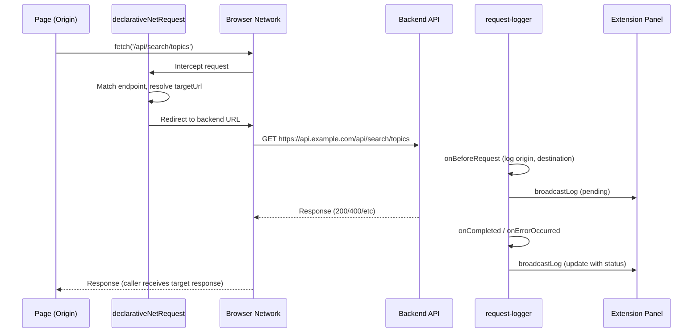
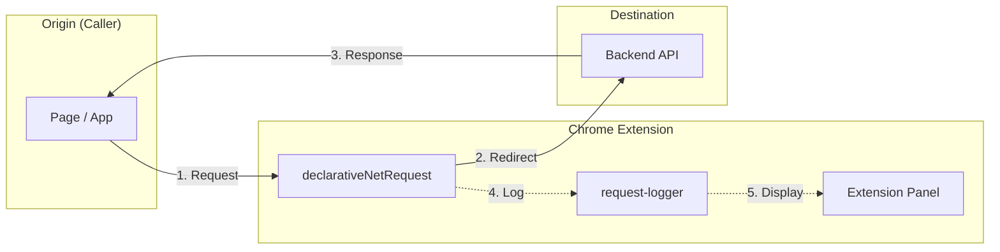
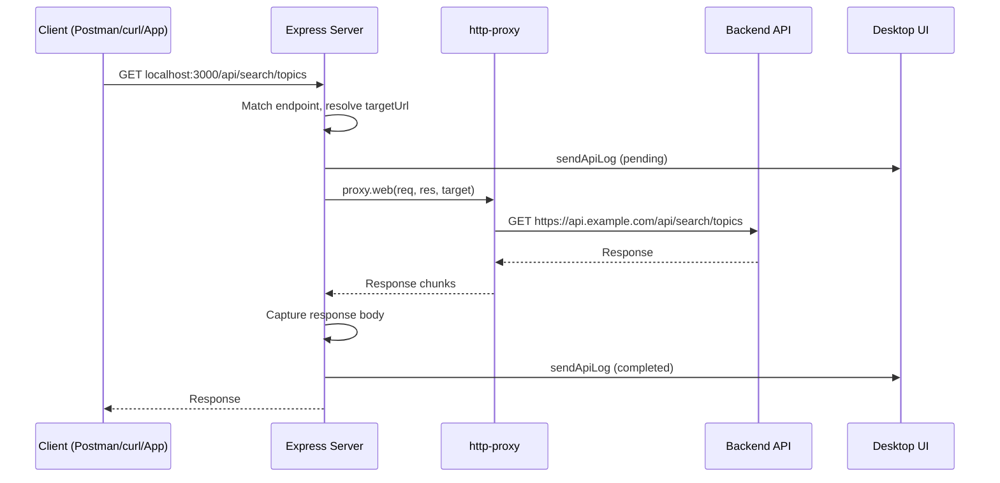
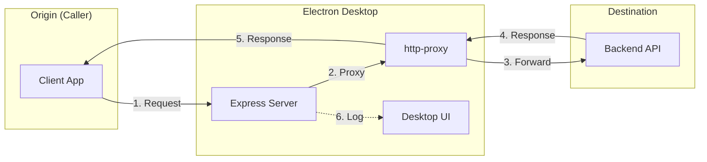

# Proxy Flow Diagram

Visual representation of the request flow in proxy mode for both Extension and Desktop.

---

## Extension Mode (Chrome)

The extension uses `declarativeNetRequest` to redirect matching requests from the page to the backend. The response flows back to the caller.

---

## Desktop Mode (Electron)

The desktop runs a local Express server. Clients send requests to localhost; the proxy forwards to the backend and returns the response.

---

## Summary

| Mode     | Origin              | Destination | Response flow                    |
|----------|---------------------|-------------|-----------------------------------|
| Extension| Page (initiator)     | Backend API | Target response → Page           |
| Desktop  | Client (localhost)   | Backend API | Target response → Client          |

In both modes, **the caller receives the response from the target**—the proxy transparently forwards the request and returns the backend's response.
