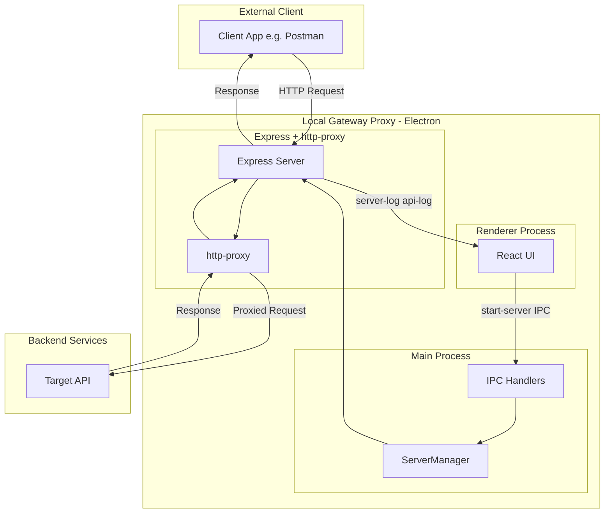
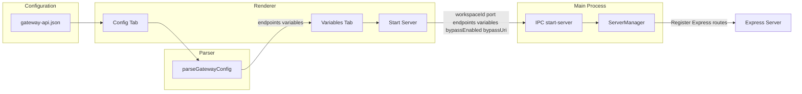
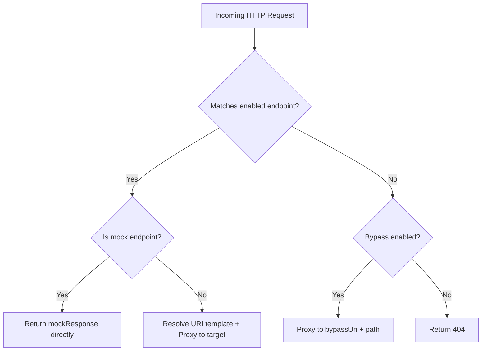
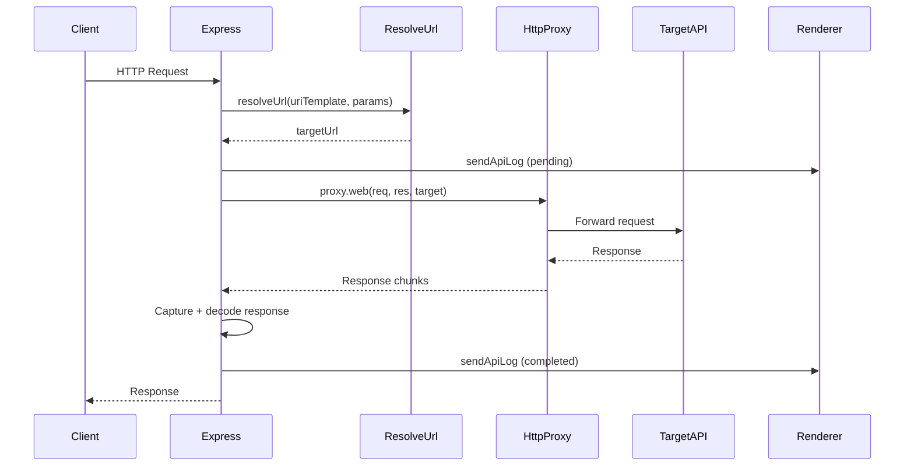
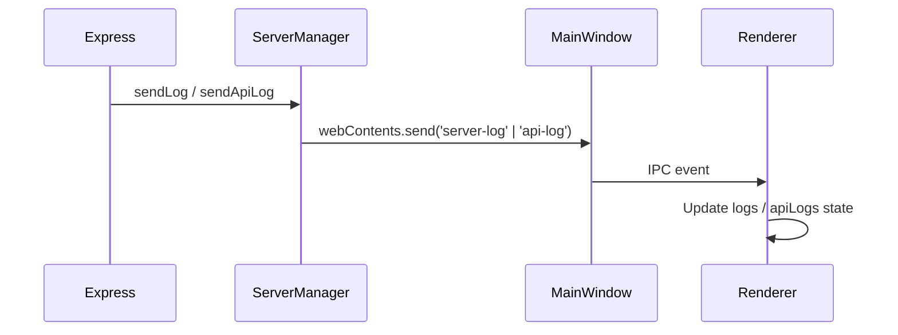

# Request Flow Specification

This document describes the end-to-end request flow through the Local Gateway Proxy application. It covers architecture, configuration parsing, routing logic, proxy behavior, and logging.

---

## 1. High-Level Architecture

The Local Gateway Proxy is an Electron desktop application that runs a local HTTP proxy server. External clients (e.g., Postman, curl, or frontend apps) send requests to the proxy; the proxy routes them to configured backend targets based on an AWS API Gateway-style configuration.

**Flow summary:**
- Client sends HTTP request to `localhost:{port}` (e.g., `http://localhost:3000/api/content/topics`)
- Express receives the request and matches it against registered routes
- For proxy endpoints, http-proxy forwards the request to the target URL
- Logs are sent from the main process to the renderer via IPC for display in the UI

---

## 2. Configuration Flow

Configuration is loaded from an AWS API Gateway-style JSON file (e.g., `gateway-api.json`). The parser extracts endpoints and variables; the user configures variable values; the server is started with the full config.

**Steps:**
1. User loads or pastes JSON in the Config tab
2. [parser.ts](../src/renderer/src/utils/parser.ts) extracts:
   - `paths` and HTTP methods
   - `uri` templates (e.g., `http://${stageVariables.notificationv20Hostname}/topics`)
   - Variables from `${variableName}` placeholders
   - Mock responses from `responseTemplates` for `type: "mock"` integrations
3. Variables tab shows extracted variables for the user to fill
4. On "Start Server", the renderer invokes `start-server` IPC with `{ workspaceId, port, endpoints, variables, bypassEnabled, bypassUri }`
5. ServerManager registers Express routes for each enabled endpoint

---

## 3. Request Routing Flow

When a request arrives, the server decides how to handle it: mock response, proxy to target, proxy to bypass URI, or 404.

**Routing rules:**
- **Match enabled endpoint + mock**: Return the static `mockResponse` JSON; no backend call
- **Match enabled endpoint + proxy**: Resolve the URI template and proxy to the target
- **No match + bypass enabled**: Proxy to `bypassUri + req.path + queryString`
- **No match + bypass disabled**: Return 404 with message "No route found in gateway config"

---

## 4. Proxy Request Flow (Detailed)

For non-mock requests that match an enabled endpoint (or bypass), the following steps occur in [server.ts](../src/main/server.ts):

**Step-by-step:**

1. **URL Resolution** (`resolveUrl`): Replace `${variable}` with workspace variables and `{pathParam}` with request path params. Throws if required variables are missing.

2. **Request capture**: Capture body for POST/PUT/PATCH; capture headers (ip, user-agent, api-key, idempotency-key).

3. **Send pending API log**: `sendApiLog` with `status: 'pending'` so the UI shows the request immediately.

4. **Proxy**: `proxy.web(req, res, { target: targetBase, changeOrigin: true, secure: false })` — http-proxy forwards the request to the backend.

5. **Response interception**: Override `res.write` and `res.end` to collect response chunks.

6. **Decode**: Handle gzip/deflate/br if present; decode to UTF-8 for logging.

7. **Send completed API log**: Update the log entry with status code, duration, response body, and `status: 'completed'` or `'error'`.

---

## 5. Bypass Flow

When bypass is enabled and the request does **not** match any enabled endpoint:

1. Build target URL: `bypassUri + req.path + queryString` (e.g., `https://api.app.com/api` + `/posts` → `https://api.app.com/api/posts`)
2. Use the same proxy and logging flow as normal proxy requests
3. Set `isBypass: true` in API logs so the UI can distinguish bypass requests

Bypass is implemented as a catch-all Express middleware that runs after all endpoint routes. If no endpoint matched, the request is forwarded to the bypass URI.

---

## 6. Logging Flow

Logs flow from the Express server (main process) to the React UI (renderer) via Electron IPC.

**Log types:**
- **server-log**: General server messages (e.g., "Server started", "GET /api/topics -> https://...")
- **api-log**: Per-request details (method, path, status, duration, request/response body). Uses `logId` for create vs update; pending requests are created, then updated when the response arrives.

---

## Appendix: Endpoint Types and Variable Syntax

### Endpoint Types

| Type | Integration | Behavior |
|------|-------------|----------|
| **http_proxy** | `type: "http_proxy"` or `type: "http"` or omitted | Proxies the request to the `uri` template. Path params and variables are resolved at request time. |
| **mock** | `type: "mock"` | Returns a static JSON body from `responseTemplates['application/json']`. No backend call. |

### Variable Syntax

| Syntax | Example | Resolved from |
|--------|---------|---------------|
| `${variableName}` | `${stageVariables.notificationv20Hostname}` | Workspace Variables tab |
| `{pathParam}` | `{id}` in `/topics/{id}` | Request path (e.g., `/topics/abc` → `id: "abc"`) |

### Key Files

| Component | File | Purpose |
|-----------|------|---------|
| Server logic | [src/main/server.ts](../src/main/server.ts) | Express routes, http-proxy, resolveUrl, matchPath, logging |
| IPC | [src/main/index.ts](../src/main/index.ts) | start-server, stop-server handlers |
| Parser | [src/renderer/src/utils/parser.ts](../src/renderer/src/utils/parser.ts) | Parse gateway JSON to endpoints + variables |
| Config format | [gateway-api.json](../gateway-api.json) | Example AWS API Gateway-style config |
